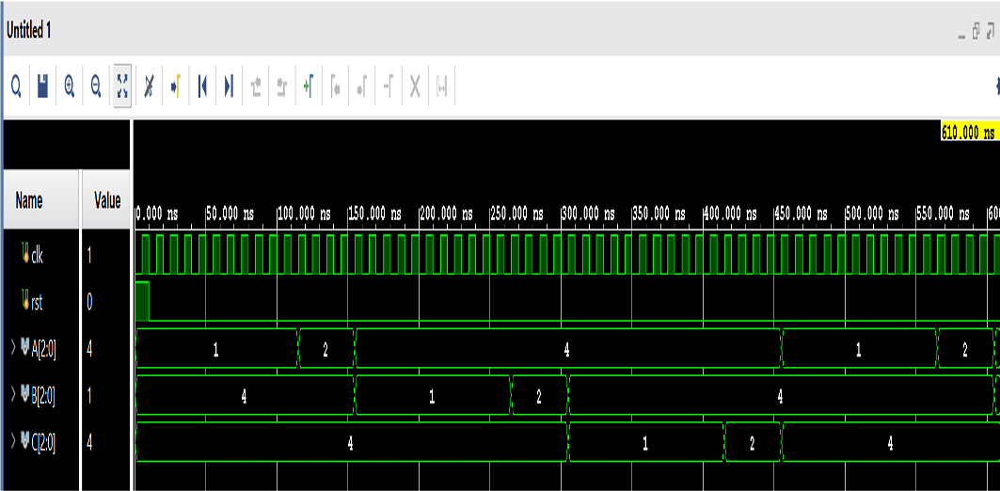
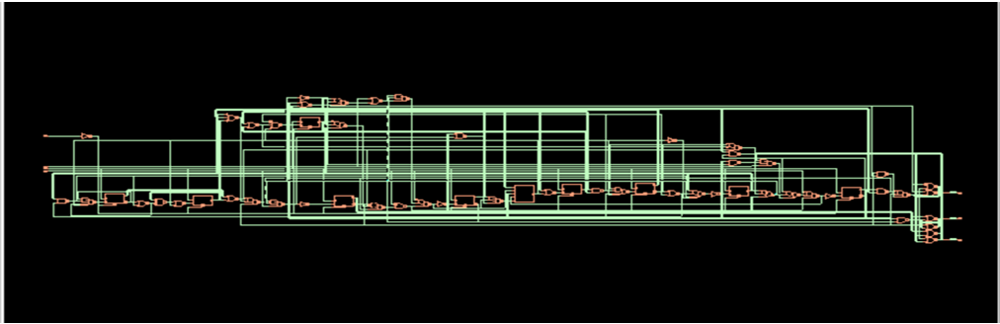
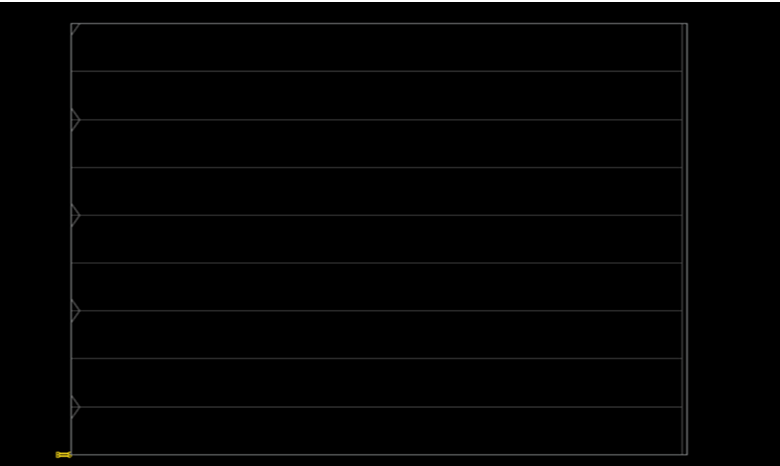
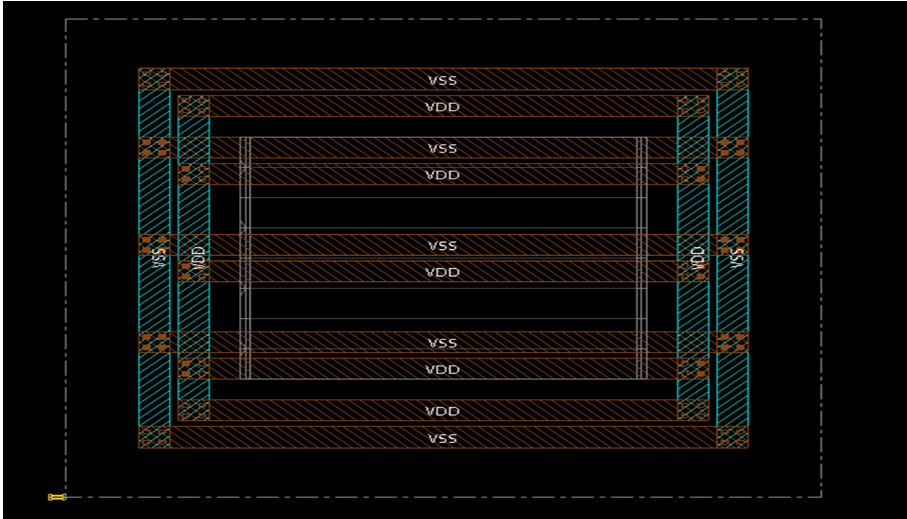
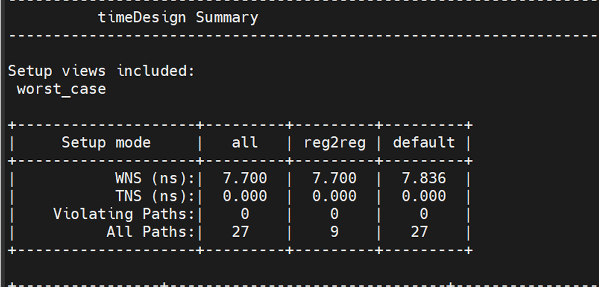
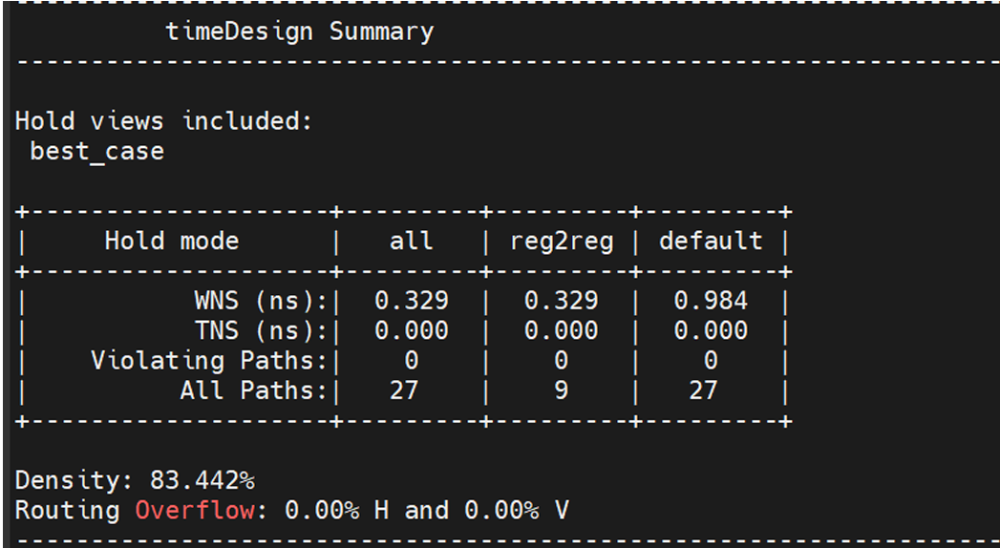
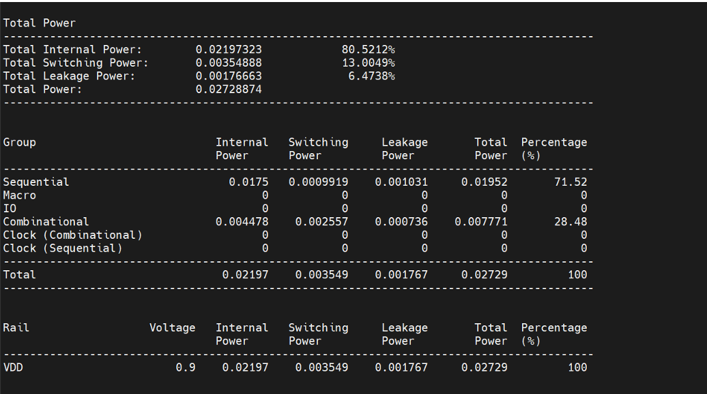
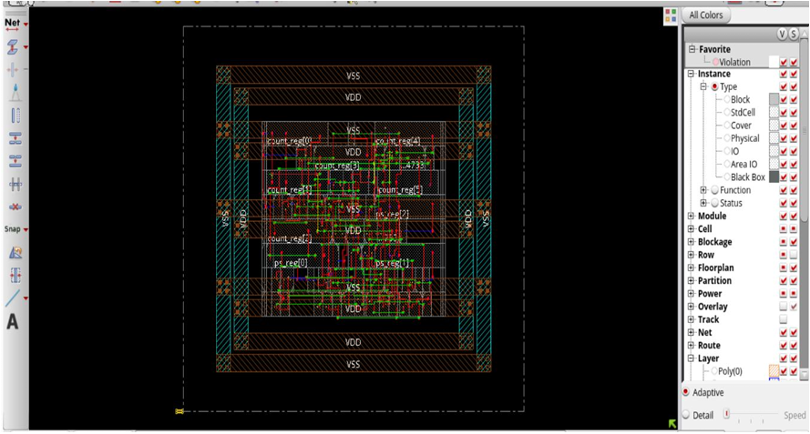

# 3-Way Traffic Light Controller — RTL-to-GDSII ASIC Implementation

RTL-to-GDSII implementation of a 3-way traffic light controller using Verilog HDL and Cadence Genus and Innovus.

## 📌 Overview

This project implements a smart 3-way traffic light controller using a Finite State Machine (FSM). The design was developed in Verilog HDL and taken through a complete RTL-to-GDSII ASIC design flow.

The project covers:

- RTL design and simulation
- Logic synthesis using Cadence Genus
- Floorplanning
- Power planning
- Placement
- Clock Tree Synthesis (CTS)
- Routing
- Post-route timing analysis
- Power analysis
- Final GDSII-oriented physical implementation

## 🎯 Project Objective

The objective is to design a reliable three-way traffic light controller at RTL and implement it through the complete ASIC physical design flow, demonstrating the transition from Verilog RTL to a physically routed design.

## 🧩 Design Specification

The controller consists of three traffic directions:

- **Road A**
- **Road B**
- **Road C**

Each direction follows the sequence:

**Green → Yellow → Red**

The controller is implemented using a six-state FSM:

| State | Road A | Road B | Road C |
|-------|--------|--------|--------|
| S0    | Green  | Red    | Red    |
| S1    | Yellow | Red    | Red    |
| S2    | Red    | Green  | Red    |
| S3    | Red    | Yellow | Red    |
| S4    | Red    | Red    | Green  |
| S5    | Red    | Red    | Yellow |

### Timing

- Green duration: **10 clock cycles**
- Yellow duration: **3 clock cycles**

### Inputs

- `clk` — System clock
- `rst` — Reset

### Outputs

- Road A traffic light
- Road B traffic light
- Road C traffic light

## 💻 RTL Design and Simulation

The traffic light controller was designed using **Verilog HDL** and verified through RTL simulation using **Xilinx Vivado**.

### RTL Source Files

- 📄 [Traffic Light Controller RTL](RTL/traffic_3way.v)
- 🧪 [RTL Testbench](RTL/traffic_tb.v)

The RTL simulation was performed in **Vivado** to verify the FSM state transitions and the corresponding traffic light outputs for Roads A, B, and C.

### RTL Simulation Result

The waveform below shows the FSM transitions and corresponding traffic light outputs during simulation.

## 🔄 RTL-to-GDSII Flow
## 🔧 Logic Synthesis — Cadence Genus

The verified RTL design was synthesized using **Cadence Genus** with a 90nm standard-cell library.

The synthesis flow converts the RTL description into a gate-level netlist while optimizing the design for area and timing.

### Synthesis Results

The synthesized design contains **60 standard cells** with a total area of **389.047 µm²**.

- **Standard Cells:** 60
- **Area:** 389.047 µm²
- **Setup WNS:** 7.904 ns

### Synthesized Schematic

The following schematic shows the synthesized gate-level implementation generated by Cadence Genus.

### Synthesis Reports

- 📊 [Area Report](Synthesis/traffic_area.rpt)
- ⏱️ [Timing Report](Synthesis/traffic_timing.rpt)

## 🏗️ Physical Design — Cadence Innovus

The synthesized netlist was taken through the physical design flow using **Cadence Innovus**. The major stages included floorplanning, power planning, placement, clock tree synthesis, and routing.

### Floorplanning

The design floorplan was created by defining the core and die area and establishing the physical boundaries for the standard-cell placement.

### Power Planning

Power rings and power distribution structures were created to provide the required VDD and VSS connections throughout the design.

### Placement and Routing

After power planning, standard cells were placed and the design was routed to establish the required signal and clock connections.

### Post-Route Timing Analysis

Post-route timing analysis was performed to verify setup and hold timing after routing.

- **Setup WNS:** 7.643 ns
- **Hold WNS:** 0.339 ns
- **Setup TNS:** 0 ns
- **Hold TNS:** 0 ns
- **Setup Violations:** 0
- **Hold Violations:** 0

### Power Analysis

Post-route power analysis was performed to evaluate the internal, switching, and leakage power of the implemented design.

- **Internal Power:** 0.02197 mW
- **Switching Power:** 0.00355 mW
- **Leakage Power:** 0.00177 mW
- **Total Power:** 0.02729 mW

## 🏁 Final Layout

The final routed design was completed in Cadence Innovus after placement, clock tree synthesis, and routing.

The final implementation achieved:

- **DRC Violations:** 0
- **Routing Overflow:** 0%
- **Total Vias:** 342
- **Total Power:** 0.02729 mW
- 
## 📊 Results

The final physical implementation achieved timing closure with no reported setup or hold violations.

| Parameter | Result |
|-----------|--------|
| Standard Cells | 60 |
| Synthesized Area | 389.047 µm² |
| Setup WNS | 7.643 ns |
| Setup TNS | 0 ns |
| Hold WNS | 0.339 ns |
| Hold TNS | 0 ns |
| Setup Violations | 0 |
| Hold Violations | 0 |
| DRC Violations | 0 |
| Routing Overflow | 0% |
| Total Vias | 342 |
| Total Power | 0.02729 mW |
| Supply Voltage | 0.9 V |

## 🏁 Conclusion

The 3-way traffic light controller was successfully implemented from Verilog RTL through synthesis and physical design using Cadence Genus and Innovus.

The final implementation achieved timing closure with zero setup and hold violations, zero DRC violations, and zero routing overflow. This project demonstrates the complete ASIC RTL-to-GDSII flow for a digital control system.

## 📄 Project Report

The complete project report documenting the RTL design, synthesis, physical design flow, timing analysis, power analysis, and final results is available below.

[View Project Report](docs/Project_Report.pdf)
